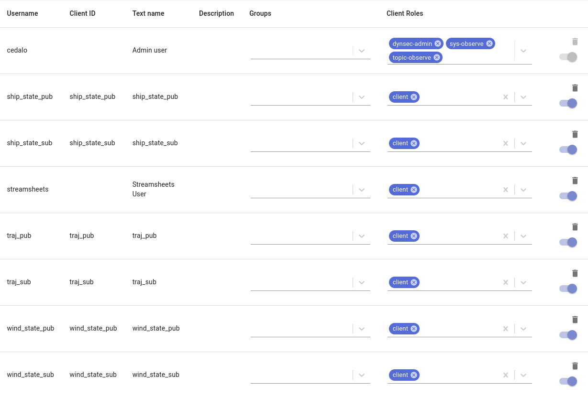

# mqtt_nmea_bridge
MQTT-NMEA-BRIDGE serves as a data link layer, translating and routing messages via MQTT. Previously custom NMEA0183 messages were used for this purpose, but to improve readability, the message strings have now been changed to a JSON format. The package name remains unchanged for now, even though it does not really fit anymore. The module aims to synchronize real-time vessel data and control commands for autonomous docking operations.


## Installation

Clone this repository to any folder. From the same folder, run:
```
pip install -e .
```

## Custom MQTT messages
The messages are on a JSON format:


### Trajectory
```JSON
{
        "type": "TRAJ",
        "body": [
            {
                "type": "SHIP_STATE",
                "body":
                    {
                        "time": WP1_TIME,
                        "latitude": WP1_LAT,
                        "longitude": WP1_LON,
                        "heading": WP1_HEADING,
                        "cog": WP1_COG, # 'None' if not available
                        "sog": WP1_SOG,
                        "nr_of_actuators": WP1_NR_OF_ACTUATORS, # Constant for all waypoints
                        "actuator_values": [WP1_ACTUATOR1, WP1_ACTUATOR2, ...]
                    }
            },
            {
                "type": "SHIP_STATE",
                "body":
                    {
                        "time": WP2_TIME,
                        "latitude": WP2_LAT,
                        "longitude": WP2_LON,
                        "heading": WP2_HEADING,
                        "cog": WP1_COG,
                        "sog": WP2_SOG,
                        "nr_of_actuators": WP2_NR_OF_ACTUATORS,
                        "actuator_values": [WP2_ACTUATOR1, WP2_ACTUATOR2, ...]
                    }
            },
            ...
        ]
    }
```


### Ship state
```JSON
    {
        "type": "SHIP_STATE",
        "body": {
            "time": TIME,
            "latitude": LAT,
            "longitude": LON,
            "heading": HEADING,
            "cog": COG, # 'None' if not available
            "sog": SOG,
            "nr_of_actuators": NR_OF_ACTUATORS,
            "actuator_values": [ACTUATOR1, ACTUATOR2, ...]
        }
    }
```

**WP1_TIME** is the time in UTC seconds since 1970-01-01 00:00:00, at the first waypoint. Alternatively, the time can be relative with respect to **WP1_TIME=0**. **WP1_LAT** and **WP1_LON** are the latitude and longitude at the first waypoint. **WP1_HEADING** is the heading of the vessel in degrees at the first waypoint. **WP1_ACTUATOR1**, **WP1_ACTUATOR2**, ... are the actuator values at the first waypoint. The same parameters are used for the second waypoint, and so on.

### Wind state
```JSON
    {
        "type": "WIND_STATE",
        "body": {
            "time": TIME,
            "speed": SPEED,
            "direction": DIRECTION
        }
    }
```

**TIME** is the time in UTC seconds since 1970-01-01 00:00:00. **WIND_SPEED** is the wind speed in m/s. **WIND_DIRECTION** is the wind direction in radians.

All angular directions are in degrees with 0 being north, 90 being east, 180/-180 being south, and -90 being west.

## Usage
The module can be run in a Python script. Please look at the example files in the examples folder for more information.
The examples work with the local Eclipse Mosquitto broker. 

To install the broker on Ubuntu v22.04, run:
```shell
sudo apt-add-repository ppa:mosquitto-dev/mosquitto-ppa
sudo apt-get update
sudo apt-get install mosquitto mosquitto-clients
sudo apt clean
```

Setup the WebUI Manager by running:
```shell
docker run -it -v ~/cedalo_platform:/cedalo cedalo/installer:2-linux
```
Select the preconfigured option and install.

The broker can now be started by running:
```shell
cd ~/cedalo_platform
sh start.sh
```

The WebUI Manager can be accessed at http://localhost:8080
With the default credentials, username: cedalo, password: mmcisawesome

Make sure to setup clients for the publishers and subscribers. This can be done by clicking on the "Clients" tab in the WebUI Manager. With the credentials used in the examples properly set up, the WebUI Manager should look like this:




## Example
The example files in the examples folder can be run from the root folder by running:

```shell
python3 examples/ex_pub_ship_state_from_dset.py
```

```shell
python3 examples/ex_sub_ship_state_from_dset.py
```

Note: The othere examples are not yet updated to the JSON message format.

The example data, located at 'example_data/example_docking_trajectory.csv', is a trajectory of a vessel docking at a port. The trajectory is generated by the MARS simulator, and is used to test the MQTT-NMEA-BRIDGE module. The trajectory is published by the publisher, and subscribed by the subscriber. The subscriber then prints the received messages to the terminal. The trajectory is experimental, and is not meant to be realistic. Thhe contents of the csv file is tructured as follows:


| timestamp (s) | X | CS | U |
| --- | --- | --- | --- |


X : [Latitude (deg) | Longitude (deg) | Heading (deg) | Surge (m/s) | Sway (m/s) | Yaw rate (deg/s)] \
CS: [COG (deg) | SOG (m/s) ] \
U: [Actuator 1 | Actuator 2 | Actuator 3 | Actuator 4 | Actuator 5 | Actuator 6 | Actuator 7 ]


Where Surge and Sway velocites are given in the BODY frame, and SOG is given in the NED frame. The actuator values are given in the range [0, 1], where 0 is the minimum value, and 1 is the maximum value. The actuator values are mapped to the following actuators:

| Actuator | Description |
| --- | --- |
| 1 | Main engine rps |
| 2 | Main engine pitch |
| 3 | Rudder angle |
| 4 | Bow thruster rps |
| 5 | Bow thruster pitch |
| 6 | Stern thruster rps |
| 7 | Stern thruster pitch |